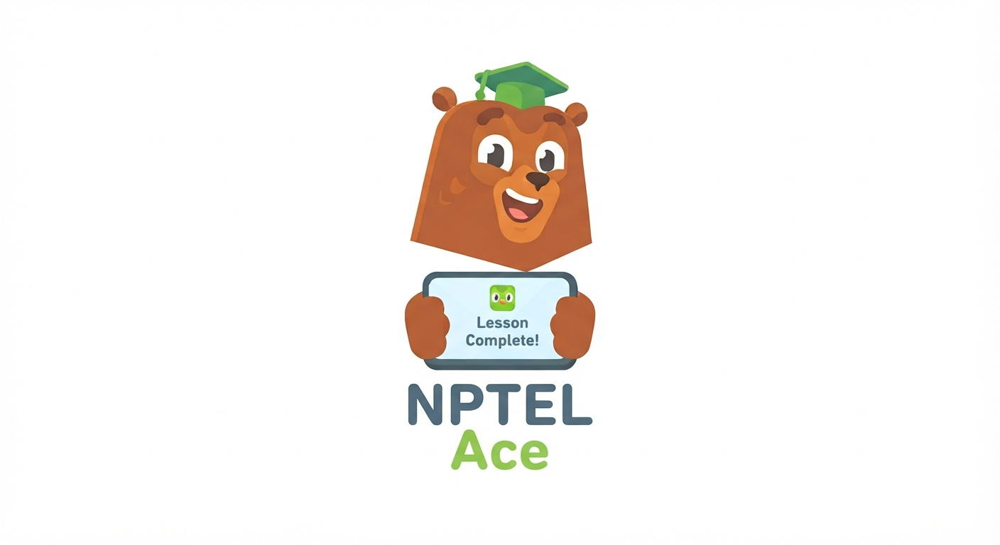

# 🐻 NPTEL Ace

[](https://nptel-cloud-mcq.onrender.com/)
[](https://github.com/Ravikant-sys/nptel-cloud-mcq)

A **Duolingo-inspired** interactive MCQ platform for NPTEL courses — practice Cloud Computing and Blockchain assignments with instant feedback, streak tracking, and a gamified learning experience.

<p align="center">
  
</p>

---

## ✨ Features

### 🎮 Duolingo-Style Quiz Flow
- **One question at a time** — focused, distraction-free learning
- **Big tappable option cards** — no tiny radio buttons, click the whole card
- **Instant feedback** — green ✅ for correct, red ❌ shake for wrong
- **Solution reveal** — detailed explanation slides up after each answer
- **Progress bar** — green fill bar at top shows quiz completion

### 🔥 Gamification
- **Streak counter** — tracks consecutive correct answers with 🔥 badge
- **Milestone celebrations** — animated overlay every 3 questions when doing well
- **Confetti animations** — particle burst on correct answers
- **Score history** — best scores saved and displayed on the dashboard
- **Animated results screen** — score, accuracy, and best streak at quiz end

### 🎨 Premium Design
- **Dark & Light themes** — smooth toggle with full theme support
- **Course-specific themes** — unique color schemes (green for Cloud, cyan for Blockchain)
- **Responsive design** — works great on mobile, tablet, and desktop
- **Smooth animations** — staggered card entrances, bouncy transitions, micro-interactions
- **Custom mascot logo** — the NPTEL Ace bear 🐻🎓

### 📚 Multi-Course Support
- **Cloud Computing** — 12 weeks, 120+ questions
- **Blockchain & Applications** — 11 weeks, 109+ questions
- **Grand Test mode** — all weeks combined and shuffled

---

## 🛠️ Tech Stack

| Layer | Technology |
|-------|-----------|
| **Frontend** | Vanilla HTML5, CSS3, JavaScript (ES6+) |
| **Styling** | CSS Grid, Flexbox, CSS Custom Properties |
| **Fonts** | Google Fonts (Outfit, Inter) |
| **Data** | JSON-structured question bank in JS |
| **Storage** | localStorage for scores and preferences |
| **Analytics** | [CounterAPI](https://counterapi.dev/) for visitor tracking |
| **Hosting** | Render (Static Site) |

---

## 🚀 Getting Started

```bash
# Clone the repo
git clone https://github.com/Ravikant-sys/nptel-cloud-mcq.git

# Open in browser
cd nptel-cloud-mcq
open index.html
```

No build step needed — it's pure HTML/CSS/JS!

---

## 📁 Project Structure

```
nptel-cloud-mcq/
├── index.html          # Home page — course selection & week dashboard
├── test.html           # Quiz page — Duolingo-style question flow
├── assets/
│   ├── logo.jpg        # NPTEL Ace bear mascot logo
│   ├── style.css       # Complete design system
│   ├── script.js       # Quiz engine & UI logic
│   └── data.js         # Question bank (Cloud + Blockchain)
└── README.md
```

---

## 📊 Engagement

- **250+ Visitors** during the initial live deployment
- Built-in visitor tracking via CounterAPI
- Hidden admin panel (5x click the logo 🤫)

---

## 📱 Screenshots

| Home | Dashboard | Quiz |
|------|-----------|------|
| Course selection with mascot | Week grid with score badges | One-question-at-a-time flow |

---

## 🤝 Contributing

Contributions are welcome! Feel free to:
- Add more NPTEL courses
- Improve the question bank
- Suggest UI/UX enhancements

---

<p align="center">
  Built with ❤️ for NPTEL students everywhere
</p>
